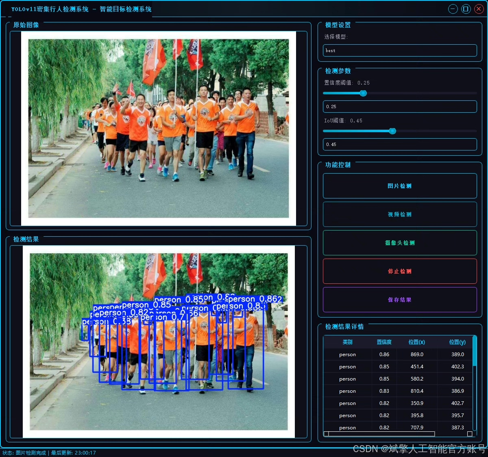
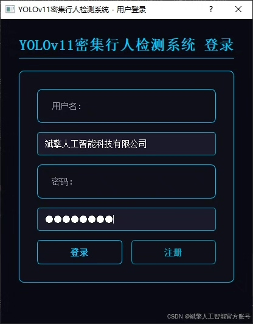
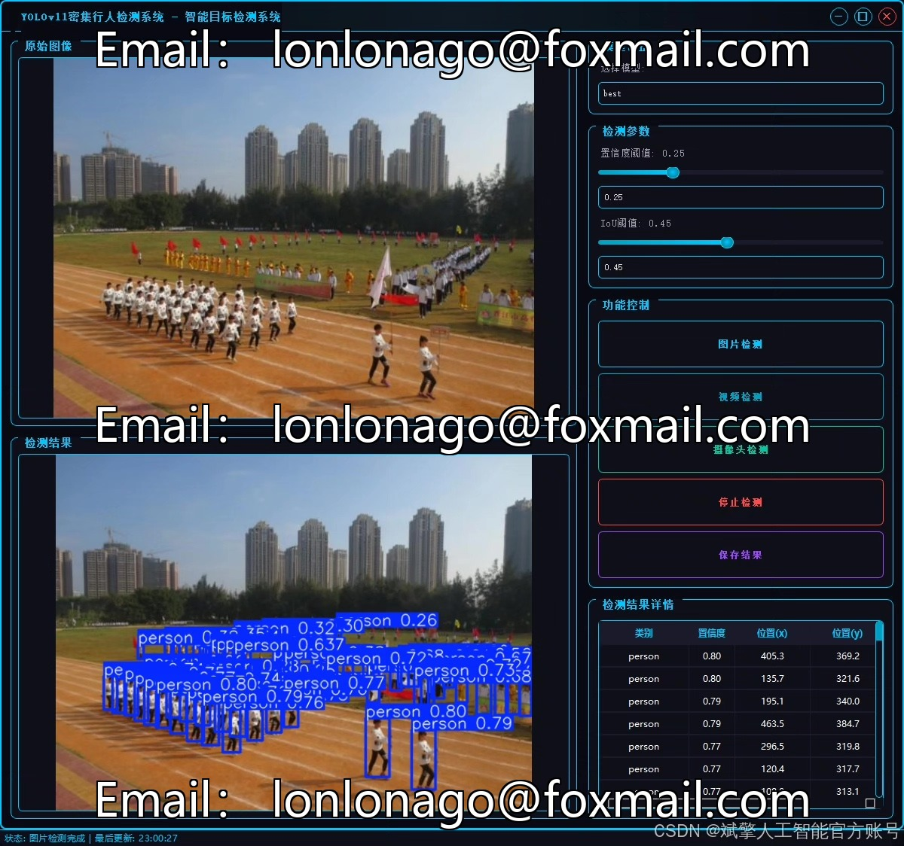
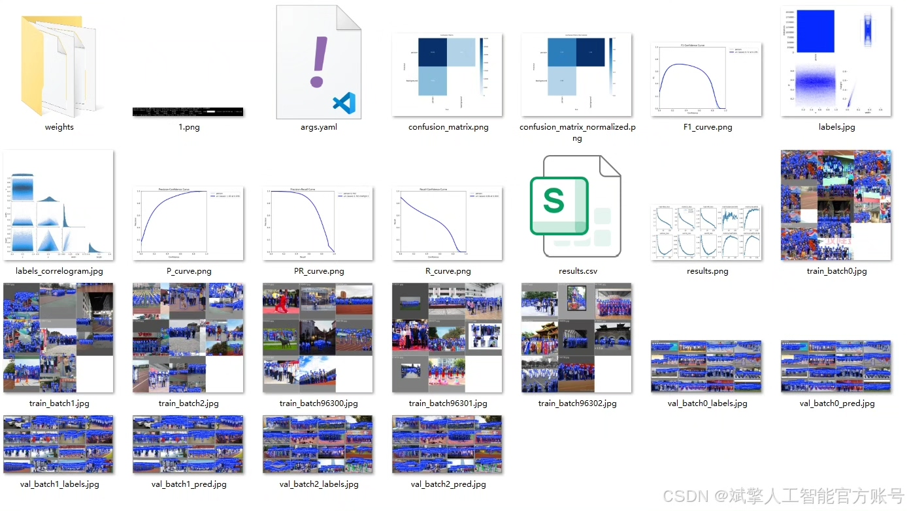
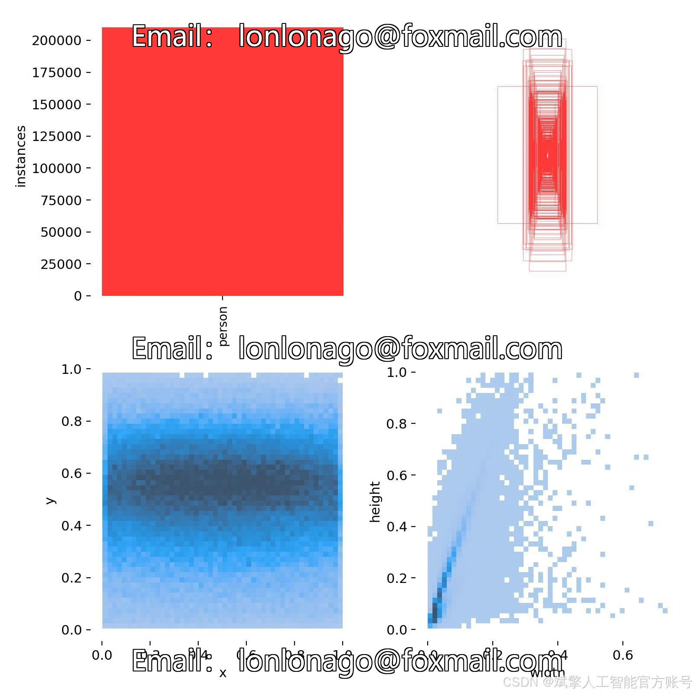
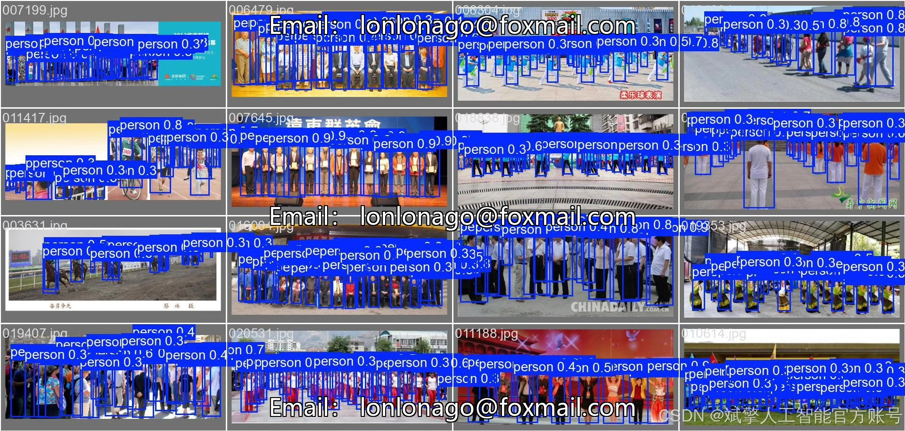

# YOLOv11 pedestrian detection system

## Body

The YOLOv11 pedestrian detection system is based on deep learning YOLOv11's dense pedestrian recognition detection system (YOLOv11+YOLO dataset + UI interface + login registration interface + Python project source code + model).

This paper designs and implements a dense pedestrian detection system based on the YOLOv11 deep learning algorithm. The system is trained and validated using the YOLO dataset, which contains 7200 images in the training set and 1800 images in the validation set, with the target category being pedestrians (person). The system integrates a user-friendly UI interface, supporting login and registration functions, enhancing the interaction experience. By optimizing the detection performance of the YOLOv11 model in dense scenarios, the system can efficiently and accurately recognize pedestrian targets in complex environments. Experimental results show that the system performs excellently in terms of accuracy and real-timeness, suitable for practical applications such as security monitoring and crowd counting. This paper provides complete Python project source code, pre-trained models, and detailed implementation plans, providing a reproducible solution for dense pedestrian detection tasks.

Dataset:
nc: 1
names: person,
Number of datasets: training set 7200, validation set 1800.

✅ User Login and Signup: Supports password detection and security verification.
✅ Three detection modes: Based on the YOLOv11 model, supports image, video, and real-time camera detection, accurately identifying targets.
✅ Dual-screen comparison: Displays the original scene and detection results on the same screen.
✅ Data visualization: Real-time table displays the category, confidence, and coordinates of detected targets.
✅ Intelligent parameter adjustment: Offers a confidence slide bar to dynamically optimize detection accuracy, adapting to different scene requirements.
✅ Sci-fi style interface: Dark theme combined with dynamic light effects, reducing visual fatigue and enhancing operational experience.

## Images

## Payment

Here is a pay link on Stripe ( https://buy.stripe.com/3cs8yP7sY87d0vu9AB ). Please contact me lonlonago@foxmail.com after funding $89, and I will send you a complete data files , thank you!

